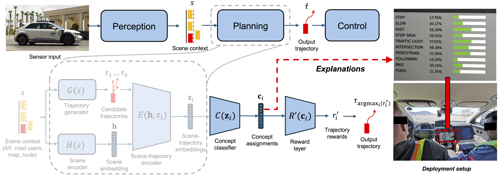

# CW-Net Reproducibility Capsule — Autonomous Driving

This repository contains all code, data, and materials to reproduce the results from the CW-Net paper on concept-based explanations for autonomous driving.



*Figure: Overview of the CW-Net architecture and how it was visualized to safety drivers and engineers.*


## Repository Structure

```
.
├── scripts/                      # Scripts for reproducing the paper figures
├── data/                         # Anonymised study data for reproducing the figures
├── code_ocean_capsule/           # Demo in a toy domain (training + visualization);
│                                 #   submitted as the Nature Code Ocean capsule
├── qualtrics_survey/             # Qualtrics surveys for running the online studies
├── original_cwnet_model_files/   # Original CW-Net model definitions that ran on the car
├── reproduce_paper_results.py    # Main runner (orchestrates all scripts)
├── plots/                        # Generated figures (created on first run)
└── logs/                         # Execution logs (created on first run)
```

## Setup

### Create the Conda environment

```bash
conda env create -f environment.yml
conda activate cwnet
```

If that doesn't work try using pip directly:

```bash
conda create -n cwnet python=3.10 -y
conda activate cwnet
pip install -r requirements.txt
```

### Reproduce all paper results

```bash
python reproduce_paper_results.py
```

Figures are saved to `plots/` and statistics logs to `logs/` (both created on
first run). The full run takes well under a minute on a laptop and is fully
deterministic. The individual scripts read data via relative paths, so run
them from the repository root (the runner does this automatically).

#### Script-to-results mapping

> **Note on Extended Data numbering:** the scripts are named after the
> Extended Data citations in the paper's body text. In the current proof the
> printed captions are shifted by one relative to those citations (e.g. the
> belief-update figure produced by `reproduce_figureED3.py` is captioned
> Extended Data Fig. 4). The mapping below describes each script by content.

| Script | Paper result | Outputs |
|--------|--------------|---------|
| `reproduce_figure3.py` | Fig. 3a/b/c (on-road CLOSE, ASV, BIKE results) | `plots/CLOSE_*.pdf`, `plots/ASV_*.pdf`, `plots/BIKE_*.pdf` |
| `reproduce_figureED3.py` | ED belief-update ("arrows") figure | `plots/combined_movement_2x2.pdf` |
| `reproduce_figureED4.py` | ED mental-model figure (text-rationale confusion matrices + NN/rationale correlation); exact binomial tests for Hypotheses 1–3; clustered OLS + interaction from the caption | `plots/ED4_mental_model_full_figure.pdf`, `logs/mental_model_alignment_stats.log` |
| `reproduce_figureED5_analysis.py` | ED mental-model-vs-prediction LME figure and caption statistics | `plots/Comparison_Task1_vs_Task2_Stacked_Reordered.pdf`, `logs/Comparison_Task1_vs_Task2_Stacked_Reordered_LME.log` |
| `reproduce_figureED7_analysis.py` | ED SAGAT results figure; Welch t-tests and Cohen's d (Methods, "Public roads evaluation using SAGAT") | `plots/overall_valence_accuracy.pdf`, `logs/overall_valence_results.log` |
| `reproduce_SI_LLM_Judge.py` | LLM-as-a-judge vs human raters interrater validation (SI) | `logs/llm_human_interrater_validation.txt` |
| `reproduce_SI_cronbach_alpha.py` | Supplementary Tables S8 and S9 (SAGAT reliability) | `logs/reproduce_SI_cronbach_alpha.log` |

Not reproducible from this repository (per the paper's Data Availability
statement): Extended Data Table 1 and Supplementary Tables 1 and 2 (they
require internal AV model outputs that cannot be released). The Code Ocean
capsule demo in `code_ocean_capsule/` requires its training data, which ships
with the capsule on Code Ocean but is not included in this repository (see
`code_ocean_capsule/README.txt`).


#### Options

```bash
# Run specific scripts only
python reproduce_paper_results.py --only reproduce_figure3.py reproduce_figureED3.py

# Skip specific scripts
python reproduce_paper_results.py --skip reproduce_SI_LLM_Judge.py reproduce_SI_cronbach_alpha.py

# Continue past failures
python reproduce_paper_results.py --continue-on-error

# Preview what would run
python reproduce_paper_results.py --dry-run
```

## Dependencies

| Package | Purpose |
|---------|---------|
| numpy | Numerical arrays and linear algebra |
| pandas | Data loading and manipulation |
| matplotlib | Figure generation |
| seaborn | Statistical visualizations |
| scipy | Statistical tests, distance metrics, optimization |
| statsmodels | Linear mixed-effects models |
| fastdtw | Dynamic Time Warping (required for the Fig. 3b DTW panels) |


## License

This repository contains code, anonymised data, and user-study materials. These are licensed separately.

- Source code is licensed under the Apache License, Version 2.0. See `LICENSE.txt`.
- Anonymised data files in `data/` are licensed under the Creative Commons Attribution-NonCommercial-ShareAlike 4.0 International License. See `LICENSE-DATA.txt`.
- User-study materials, including video stimuli showing vehicle driving scenes with overlaid concept activations, are licensed under the Creative Commons Attribution-NonCommercial-ShareAlike 4.0 International License unless otherwise stated. See `LICENSE-MATERIALS.txt`.


## Citation and acknowledgements

This repository accompanies the paper:

> Kenny et al., "Explainable deep learning improves human mental models of self-driving cars", Nature, 2026.

This work was conducted in collaboration with Motional, the Massachusetts Institute of Technology, and Harvard University.

Please cite the paper when using the code, data, or study materials from this repository.


## Data and materials release

The released data and materials are intended to support reproducibility of the published analyses. The release includes anonymised CSV files and user-study video stimuli used in the experiments.

The release does not include raw vehicle logs, raw sensor streams, internal model checkpoints, participant identifiers, reviewer names, or confidential Motional engineering materials.